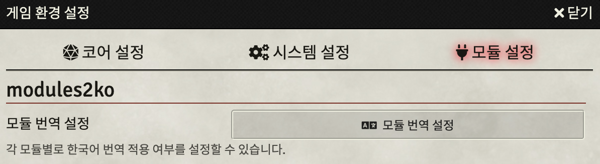

# modules2ko

Foundry Virtual Tabletop에서 자체적으로 한국어 현지화를 지원하지 않는 모듈을 번역하기 위한 모듈입니다.  
각 모듈 개발자에게 직접 풀 리퀘스트나 번역 파일을 전달하더라도 반영이 늦을 수 있는 점을 보완하기 위해 제작했습니다.

## 설치

모듈 설치 메뉴의 **매니페스트 URL 입력란**에 아래 주소를 붙여넣고 **설치** 버튼을 클릭합니다.

```https://raw.githubusercontent.com/ShoyuVanilla/FoundryVTT-modules2ko/master/module/module.json```

## 사용법

모듈 설정 메뉴에서 본 모듈을 활성화합니다.  
현재 언어 설정이 한국어로 되어 있을 경우 본 모듈에 번역 파일이 포함된 모든 모듈이 자동으로 번역됩니다.



설정에서 각 모듈별로 한국어 번역 적용 여부를 설정할 수 있습니다.

## 번역 기여하기


위와 같이 본 모듈의 `module/localizations` 폴더에서 **Create new file** 버튼을 클릭해 번역 파일을 추가합니다. 파일 이름은 `<번역한 모듈 명칭>.json` 형식이어야 합니다.

모듈 명칭은 각 모듈의 설치 폴더 이름과 같으며 `module.json` 파일에 `name` 항목으로 명시되어 있습니다.  

```
{
	"name": "modules2ko",
	"title": "modules2ko",
	"description": "한국어 공식 번역이 포함되지 않은 모듈을 한국어로 번역합니다.",
...
```

본 모듈의 예를 들면, 위와 같이 모듈의 `name` 항목이 `modules2ko` 이므로 번역 파일 이름은 `modules2ko.json`입니다.


작성이 끝났으면 스크롤을 아래로 내린 후 위와 같이 **Propose changes** 버튼을 클릭해 제출합니다.
어떤 작업인지 알릴 수 있는 간단한 메시지를 첨부하면 좋습니다.


다음으로 `module` 폴더 아래의 `info.json` 파일에서 위와 같이 연필 모양 아이콘을 클릭해 번역 정보를 기입합니다.

```
...
	"<번역한 모듈 명칭>": {
		"translators": [
			"<역자>"
		],
		"version": "<번역한 모듈 버전>"
	}
}
```

새 번역 파일을 추가했을 때와 마찬가지로 **Propose changes** 버튼을 클릭해 제출합니다.
