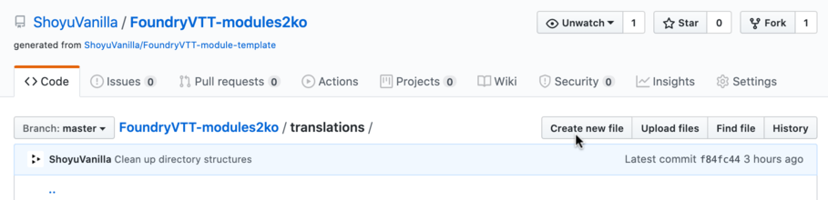

# Modules to Korean

Foundry Virtual Tabletop에서 자체적으로 한국어화를 지원하지 않는 모듈을 번역하기 위한 모듈입니다.  
각 모듈 개발자에게 직접 풀 리퀘스트나 번역 파일을 전달하더라도 반영이 늦을 수 있는 점을 보완하기 위해 제작했습니다.

## 설치


모듈 설치 메뉴의 **매니페스트 URL 입력란**에 아래 주소를 붙여넣은 후 **설치** 버튼을 클릭합니다.

```https://raw.githubusercontent.com/ShoyuVanilla/FoundryVTT-modules2ko/master/module/module.json```

## 사용법

모듈 설정 메뉴에서 본 모듈을 활성화합니다.  
현재 언어 설정이 한국어로 되어 있을 경우 본 모듈에 번역 파일이 포함된 모든 모듈이 자동으로 번역됩니다.

<br/><br/>


설정에서 각 모듈별로 한국어화 적용 여부를 설정할 수 있습니다.

## 번역 기여하기

> ⚠️ 흥미와 예시를 제공하기 위해 본 모듈은 스스로를 한국어화합니다!  
> 번역 반영 과정이 헷갈릴 경우 [translations/modules2ko 폴더](https://github.com/ShoyuVanilla/FoundryVTT-modules2ko/tree/master/translations/modules2ko) 내용을 참고하시길 바랍니다.



본 모듈의 `translations` 폴더에서 **Create new file** 버튼을 클릭해 번역 파일을 추가합니다.  

<br/><br/>


파일 이름을 적는 란에 `<번역할 모듈 이름>`을 입력해 하위 폴더를 생성합니다.  
번역할 모듈 이름 뒤에 슬래시(`/`)를 입력하면 아래와 같이 하위 폴더가 생성됩니다.

<br/><br/>


파일 이름을 적는 란에 `ko.json`을 마저 입력한 후 번역할 텍스트를 붙여넣습니다.

<br/><br/>


작성이 끝났으면 스크롤을 아래로 내린 후 **Propose changes** 버튼을 클릭해 제출합니다.  
어떤 작업인지 알릴 수 있는 간단한 메시지를 첨부하면 좋습니다.

<br/><br/>


마찬가지로 같은 하위 폴더에 `meta.yml` 파일을 생성합니다.  
입력 형식은 아래와 같습니다.

```
name: <모듈 명칭>
translators:
  - <역자1>
  - <역자2>
version: <번역한 모듈 버전>
```

모듈 명칭은 모듈의 설치 폴더 이름과 같으며 각 모듈의 `module.json` 파일에 `name` 항목으로 명시되어 있습니다.

```
{
	"name": "modules2ko",
	"title": "Modules to Korean",
	"description": "한국어 공식 번역이 포함되지 않은 모듈을 한국어로 번역합니다.",
	...
```

본 모듈을 예로 들면 모듈 명칭은 모듈의 `name` 항목에 해당하는 `modules2ko` 입니다.

역자를 적는 칸에는 사용하시는 닉네임 등을 적어 주시면 됩니다. 단, `Shoyu Vanilla(Discord: Shoyu Vanilla#3445)` 처럼 SNS 계정 등을 적기 위해 콜론(`:`)이나 대쉬(`-`), 샾(`#`)등의 특수문자를 사용하는 경우, `- "Shoyu Vanilla(Discord: Shoyu Vanilla#3445)"` 와 같이 쌍따옴표(`"`)로 역자 이름을 둘러싸야 합니다.

작성이 끝났다면 `ko.json` 파일을 추가한 경우와 마찬가지로 **Propose changes** 버튼을 클릭해 제출합니다.

<br/><br/>


기존 번역을 수정하시는 경우 번역을 수정할 파일에서 연필 모양 버튼을 클릭합니다.  
수정을 마친 후 새 번역 파일을 추가했을 때와 마찬가지로 **Propose changes** 버튼을 클릭해 제출합니다.

번역한 모듈이 업데이트 돼서 이에 맞게 번역 파일을 업데이트 할 경우 `meta.yml` 파일도 마찬가지로 수정해서 버전을 갱신합니다.
